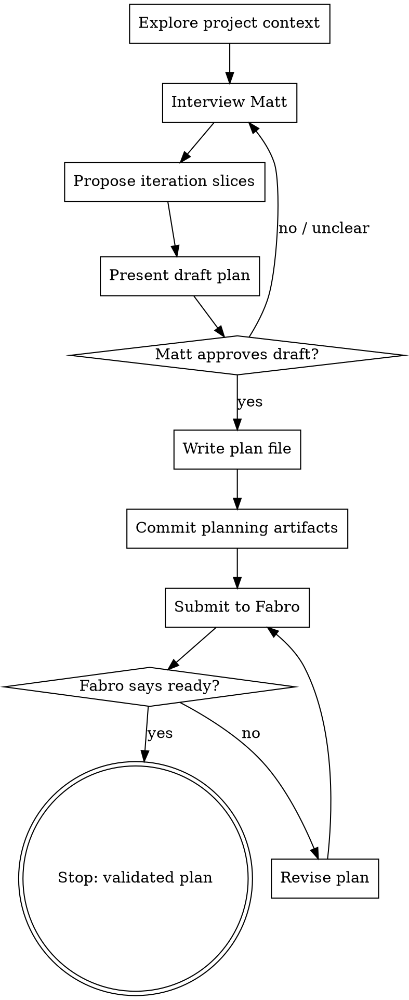

# Iteration Planning Interview

## Overview

Help Matt turn an early idea for the next iteration into an implementation-ready iteration plan. Interview him through natural collaborative dialogue, write the plan down, and submit it to Fabro's plan-validation workflow.

<HARD-GATE>
Do NOT implement the iteration. Do NOT edit application code, migrations, step definitions, UI, or production docs except for iteration-planning artifacts in that iteration's `docs/iterations/` folder and acceptance feature files/scenarios when they are part of planning. Feature files are domain modelling and acceptance criteria; step definitions and executable test plumbing are implementation. This skill's terminal state is a submitted Fabro validation run or a clear explanation of why submission was blocked.
</HARD-GATE>

## Checklist

Create a task for each item and complete them in order:

1. **Explore project context** — read relevant project docs, current plans, ADRs, recent commits, and code only as needed to understand the iteration.
2. **Interview Matt** — ask clarifying questions one at a time about goal, scope, acceptance criteria, business decisions, implementation shape, and validation.
3. **Propose 2-3 iteration slices** — include trade-offs and recommend the smallest useful slice.
4. **Present draft plan sections and feature scenarios** — get Matt's approval or corrections before writing the final plan. If acceptance feature files/scenarios are drafted or changed, explicitly invite Matt to review them as domain language before calling the plan done.
5. **Write the iteration plan** — create an iteration folder at `docs/iterations/<iteration-number>-<topic>/` and save the plan as `plan.md` inside it. Add supporting planning artifacts there too, such as a manual demo/test script when useful. Draft or update acceptance feature files/scenarios when they clarify the domain behaviour for the iteration. Maintain `docs/iterations/README.md` as an index.
6. **Publish planning artifacts** — commit and push the plan, iteration index, supporting planning artifacts, acceptance feature files, and any workflow/skill changes needed for validation before running Fabro, so Fabro's clone-based remote sandbox can see them. Do not commit or push unrelated changes.
7. **Submit to Fabro** — run the plan-validation workflow against the saved plan.
8. **Handle Fabro feedback** — if Fabro says NOT READY, summarize blockers and interview/revise/resubmit unless Matt stops.

## Process Flow



## Supplementary BDD Skills

When an iteration changes acceptance tests or introduces non-obvious user/domain behaviour, consider using the project-local `bdd-discovery` and `bdd-formulation` skills during planning.

Use `bdd-discovery` before writing Gherkin when the behaviour, rules, examples, questions, or slice boundaries need collaborative exploration.

Use `bdd-formulation` when drafting or reviewing Gherkin scenarios so feature files remain domain modelling artifacts rather than test scripts.

Do not force these skills for purely technical, obvious, or infrastructure-only iterations where acceptance scenarios would add little value.

## Interview Guidance

Ask only one question per message. Prefer multiple choice when it lowers effort, but use open questions when needed.

Cover these topics:

- **Goal** — what should be true after the iteration that is not true now?
- **Beneficiary** — who benefits: club admin, member, developer/operator, or another actor?
- **Smallest useful slice** — what is the smallest deliverable that changes capability?
- **Scope boundaries** — what is explicitly out of scope?
- **Acceptance criteria** — concrete behaviours, examples, edge cases, permissions, and error states.
- **Business decisions** — domain, policy, copy, workflow, pricing, privacy, or support questions.
- **Technical shape** — likely modules, data, events/commands, integrations, UI, background work, and migration concerns.
- **Validation** — automated tests, acceptance tests, shared Cucumber scenarios, manual demo, stakeholder review, or operational checks.

Stop interviewing when you can write a plan that an engineer could start without inventing material product or technical decisions.

## Iteration Slice Options

Before drafting the plan, propose 2-3 possible slices:

- Lead with the recommended smallest useful slice.
- Explain what each slice delivers.
- Explain what each slice defers.
- Call out major risks and unknowns.
- Ask Matt which slice to use.

## Plan Format

Write the plan as Markdown with these sections:

```markdown
# <Iteration title>

Date: YYYY-MM-DD
Status: draft | ready | needs-revision

## Goal

## Background / Context

## Scope

### In scope

### Out of scope

## Acceptance Criteria

## Open Business Decisions

## Implementation Plan

## Open Technical Decisions

## New Capability

What we expect to be able to do once this is done that we could not do before.

## Validation Plan

How we will validate that we have been successful.

## Risks / Follow-ups
```

Keep plans focused. If a section has no open decisions, write `None known.` rather than omitting it.

## Writing the Plan

- Create `docs/iterations/` if it does not exist.
- Maintain `docs/iterations/README.md` as the iteration index.
- Create one folder per iteration using the next sequential zero-padded iteration number and a lowercase hyphenated topic slug.
- Determine the next number by inspecting existing `docs/iterations/NNN-*` folders; start at `001` if none exist.
- Save the plan as `plan.md` inside that folder.
- Put supporting planning artifacts for the same iteration in the same folder, such as `manual-demo-script.md` or `validation-notes.md`.
- Draft or update shared Cucumber feature files/scenarios when they clarify the iteration's domain behaviour. Consider using `bdd-discovery` first if the rules/examples are unclear, and `bdd-formulation` when writing or reviewing the Gherkin. Keep scenarios abstract from test infrastructure: no CSS selectors, route names, button-click choreography, database setup, or adapter configuration.
- When feature files/scenarios are created or changed, show Matt the feature file path and a concise summary of the scenarios, and explicitly ask him to review the language/examples before treating the plan as final.
- Do not implement step definitions, fixtures, app code, migrations, UI, or test adapters during planning.
- Add or update the index entry in `docs/iterations/README.md` with the iteration number, title/topic, plan link, date, status, and any acceptance feature files changed.
- Example: `docs/iterations/001-member-import/plan.md`.
- Commit and push the plan, iteration index, supporting planning artifacts, and acceptance feature files before running Fabro validation so the clone-based remote sandbox can see them.
- Include workflow/skill changes in that commit only when they are needed for planning or validation.
- Do not commit or push unrelated changes or implementation work.

## Submitting to Fabro

Submit the saved plan with the project's plan-validation workflow after committing and pushing the planning artifacts. The workflow runs in a clone-based remote sandbox; pushed artifacts are required so Fabro can read newly-created plans and acceptance feature files.

```bash
fabro run .fabro/workflows/plan-validation/workflow.toml -I plan_path=docs/iterations/NNN-topic/plan.md
```

If the local Fabro server is unavailable or the command fails before creating a run:

1. Report the exact error.
2. Do not treat the plan as validated.
3. Tell Matt the plan file path and the exact command to retry.

If Fabro completes with NOT READY:

1. Summarize the blocking gaps.
2. Ask Matt one question at a time to resolve them.
3. Edit the plan.
4. Resubmit.

If Fabro completes with READY:

1. Mark the plan status as `ready`.
2. Report the plan path and Fabro run/result details.
3. Stop. Do not implement.

## Key Principles

- One question at a time.
- Prefer the smallest useful iteration.
- Make business decisions explicit.
- Make technical decisions explicit enough to start.
- Make acceptance criteria testable.
- Make validation observable.
- Do not implement during this skill.
